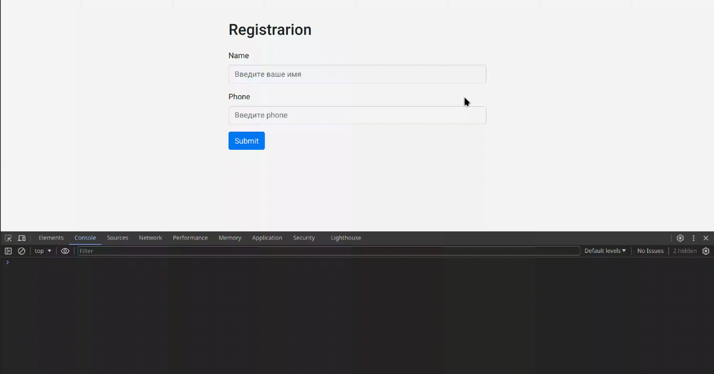

[](https://classroom.github.com/a/hXUsh42N)
## Правила и регламент

- [Экзамен: правила, рекомендации и порядок проведения](https://hexly.notion.site/d9289c18871c44508bc7c7f05a51d94f)

## Задание

Ваша задача написать логику для валидации предоставленной формы и отправки данных на сервер. Шаги могут быть выполнены в любом порядке, кроме первого шага, который обязательно должен быть выполнен первым.



## Запуск и сборка приложения

Для запуска приложения используйте команду:

```bash
make run # запускается сервер и сборка
```

## Задача 1

В файле **src/index.js** напишите и экспортируйте по умолчанию функцию, которая добавляет форму регистрации в **index.html**. Форма должна быть добавлена как дочерний элемент по отношению к элементу с классом `form-container`.

### Форма

```html
<form id="registrationForm">
    <div class="form-group">
        <label for="inputName">Name</label>
        <input type="text" class="form-control" id="inputName" placeholder="Input name" name="name" required>
    </div>
    <div class="form-group">
        <label for="inputPhone">Phone</label>
        <input type="text" class="form-control" id="inputPhone" placeholder="Input phone" name="phone" required>
    </div>
    <input type="submit" value="Submit" class="btn btn-primary">
</form>
```

## Задача 2

Добавьте в приложение логику, которая отправляет запрос на сервер и, в случае успешной отправки, выводит оповещение.

### Условия

- При клике на кнопку Submit, должен совершаться POST запрос, по адресу /people
- В случае успешного ответа содержимое `document.body` нужно заменить на:

```html
<h3 class="mb-4">User successfully registered</h3>`.
```

## Задача 3

Добавьте в функцию логику, которая изменяет статус инпутов, добавляя к ним соответствующие классы.

### Этапы реализации задачи

1. Необходимо написать саму логику валидации для полей *name* и *phone*. 

- Валидным именем считается любая строка с длиной больше 0, исключая пробелы. 
- Валидным телефоном считается любая строка с символом + вначале, содержащая только цифры, с длиной символов = 10 (не считая символа +), исключая пробелы.

2. Реализовать добавление нужных стилей, при вводе данных в соответствующее поле.

- Если содержимое инпута валидно, то он имеет класс `is-valid`
- Если содержимое инпута невалидно, то он имеет класс `is-invalid`
- Если в инпут еще ничего не ввели, то никаких статусов нет

### Примеры валидных и невалидных значений

```javascript
// names
'Иван' // valid
'ь' // valid
' ' // invalid
'' // invalid

//phones
'+1234567891' // valid
'+0000000000' // valid
'+123456789' // invalid
'+12345678911' // invalid
'+123 45678 911' // invalid
'+123-456-89' // invalid
'123456789' // invalid
' ' // invalid
'' // invalid
```

## Задача 4

Добавьте в функцию логику, которая меняет статус у кнопки `Submit`, основываясь на валидации инпутов.

### Условия изменения статуса кнопки

- Если хотя бы одно из полей невалидно, кнопка имеет статус `disabled`.
- Если все поля валидны, кнопка не имеет статус `disabled`.
